# Встановлення та початкове налаштування Easy Busy Chat для 1С/BAF (BAS)

> Інструкція підготовлена для розширень **EasyBusyChat** і **EasyBusyChatUniversal** версії 0.8.2. Назви команд або розташування елементів інтерфейсу можуть дещо відрізнятися залежно від конфігурації та версії платформи.

## Зміст

1. [Про Easy Busy Chat](#about)
2. [Системні вимоги](#requirements)
3. [Підтримувані конфігурації та вибір розширення](#configurations)
4. [Можливості в різних клієнтах та операційних системах](#clients)
5. [Підготовка до встановлення](#preparation)
6. [Встановлення розширення](#installation)
7. [Початкове налаштування](#initial-setup)
8. [Завантаження чатів](#load-chats)
9. [Робота з чатами в довідниках і документах](#usage)
10. [Перевірка після встановлення](#checklist)
11. [Типові проблеми](#troubleshooting)

---

## Про Easy Busy Chat

**EasyBusy Chats** — український омніканальний AI-центр чатів для бізнесу. Він об’єднує повідомлення з Telegram, WhatsApp, Viber, Instagram та інших каналів в одному робочому просторі, допомагає швидше відповідати клієнтам, зменшувати втрати звернень і працювати з інструментами екосистеми EasyBusy CRM.

Розширення **Easy Busy Chat для 1С/BAF (BAS)** додає до облікової системи:

- синхронізацію компаній, облікових записів, користувачів і чатів;
- зв’язування чатів із довідниками та документами інформаційної бази;
- відкриття вебвікна чату в тонкому або товстому клієнті Windows;
- надсилання текстових повідомлень і друкованих форм у чат;
- журналювання дій і технічних подій інтеграції;
- робоче місце **«Контакт-центр»** у повній версії `EasyBusyChat.cfe` для BAS Малий бізнес.

---

## Системні вимоги

| Компонент | Вимога |
|---|---|
| Платформа 1С/BAF | Мінімально заявлена — **8.3.19.1529**; рекомендована й перевірена для поточної збірки — **8.3.23.2299** |
| Режим сумісності розширення `EasyBusyChat` | **8.3.17** |
| Режим сумісності розширення `EasyBusyChatUniversal` | **8.3.14** |
| Бібліотека стандартних підсистем (БСП) | **3.1 або новіша** |
| Вебкомпонента Easy Busy Chat | Windows x86/x64, тонкий або товстий клієнт 1С/BAF |
| Додаткові компоненти Windows | Microsoft Visual C++ Redistributable 14; Microsoft Edge WebView2 Runtime |
| Доступ до мережі | HTTPS-доступ до API Easy Busy Chat і пов’язаних вебресурсів |
| Права на встановлення | Адміністратор інформаційної бази або користувач із повними правами |

> **Рекомендація.** Перед встановленням оновіть платформу до перевіреної версії та створіть резервну копію інформаційної бази. Спочатку виконайте встановлення в тестовій копії бази.

---

## Підтримувані конфігурації та вибір розширення

Розширення призначені для таких конфігурацій:

- BAS Малий бізнес 1.6;
- BAS Малий бізнес 2.0;
- BAS Управління торгівлею 3.5;
- BAS Комплексне управління підприємством 3.5;
- BAS ERP 2.5.

Оберіть файл відповідно до конфігурації та потрібного функціоналу:

| Файл | Коли використовувати |
|---|---|
| `EasyBusyChat.cfe` | Для **BAS Малий бізнес**. Містить повний функціонал, зокрема додаткову обробку — робоче місце **«Контакт-центр»** |
| `EasyBusyChatUniversal.cfe` | Для інших підтримуваних конфігурацій або коли достатньо базового функціоналу інтеграції без робочого місця «Контакт-центр» |

> **Важливо.** Перед оновленням або встановленням у продуктивній базі перевірте примітки до конкретного випуску розширення та сумісність із вашою редакцією конфігурації.

---

## Можливості в різних клієнтах та операційних системах

Повноцінне окреме вікно вебчату працює в **тонкому й товстому клієнті 1С/BAF під Windows**. Розширення містить обидва варіанти Native API-компоненти — x86 та x64; потрібну архітектуру платформа обирає автоматично.

У вебклієнті, а також у клієнтах під Linux і macOS, зовнішня Windows-компонента вебчату недоступна. Водночас залишаються доступними серверні та прикладні можливості, які не потребують відкриття окремого вікна вебчату, зокрема:

- перегляд і синхронізація списку чатів;
- створення, зміна та видалення зв’язків чатів з об’єктами бази;
- надсилання текстових повідомлень;
- надсилання друкованих форм у підтримуваних форматах.

---

## Підготовка до встановлення

### Крок 1. Перевірте сумісність і створіть резервну копію

Переконайтеся, що конфігурація, платформа й версія БСП відповідають [системним вимогам](#requirements). Зробіть резервну копію інформаційної бази та переконайтеся, що маєте файл потрібного розширення (`EasyBusyChat.cfe` або `EasyBusyChatUniversal.cfe`).

### Крок 2. Увійдіть із правами адміністратора

Запустіть базу в режимі **1С:Підприємство** під користувачем із повними адміністративними правами.

Відкрийте головне меню та виберіть **Налаштування → Параметри**.

  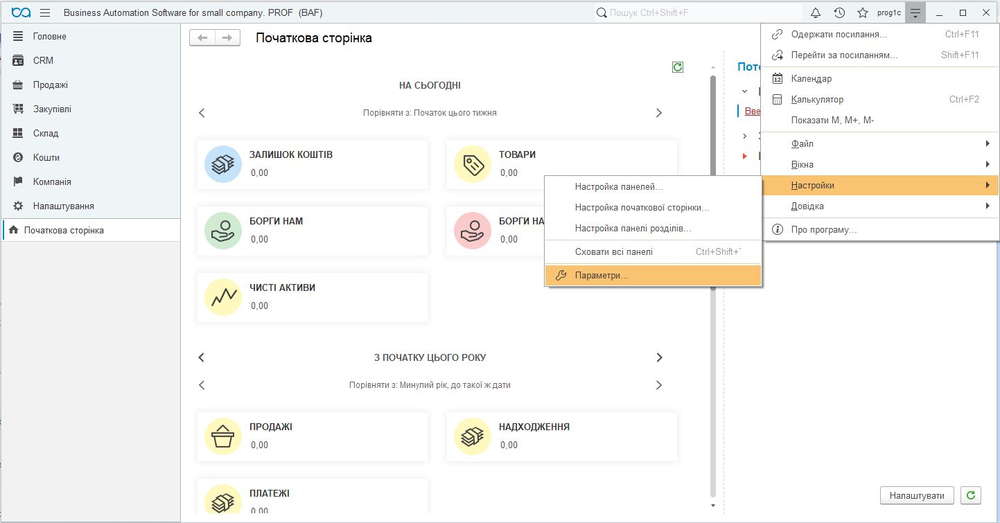

<em>Рисунок 1 — Перехід до параметрів програми</em>

Установіть прапорець **«Режим технічного спеціаліста»** та натисніть **OK**.

  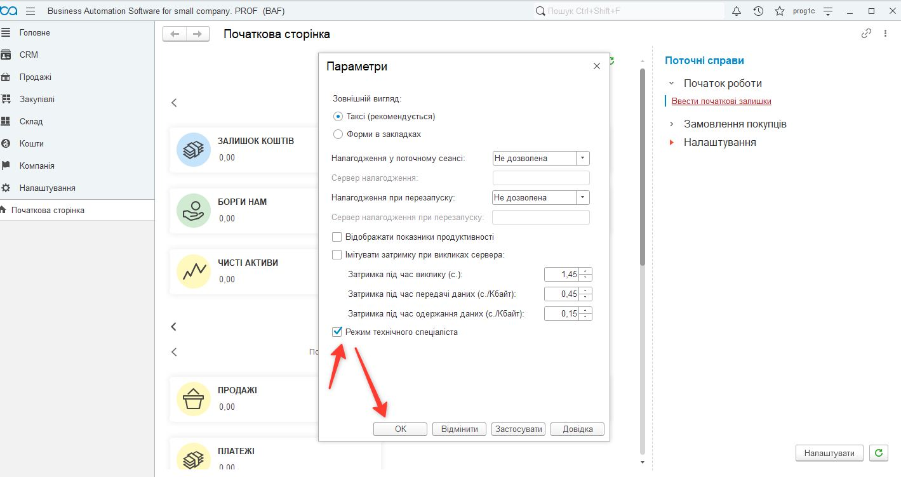

<em>Рисунок 2 — Увімкнення режиму технічного спеціаліста</em>

### Крок 3. Відкрийте керування розширеннями

У головному меню виберіть **«Функції для технічного спеціаліста…»**.

  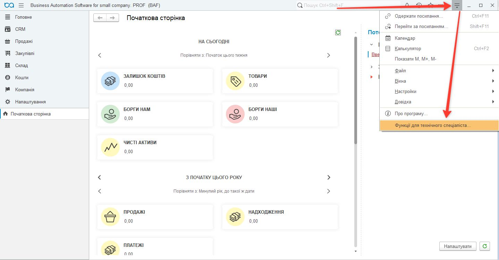

<em>Рисунок 3 — Відкриття функцій для технічного спеціаліста</em>

У розділі **«Стандартні»** відкрийте **«Управління розширеннями конфігурації»**.

  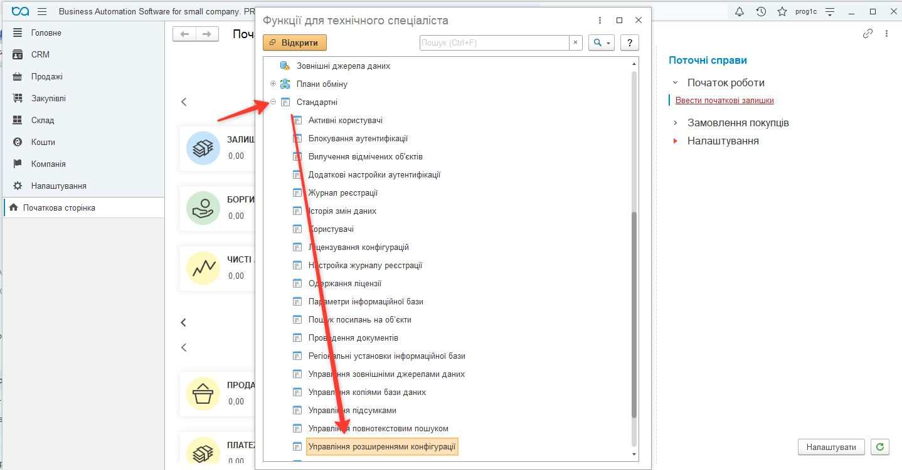

<em>Рисунок 4 — Команда «Управління розширеннями конфігурації»</em>

---

## Встановлення розширення

### Крок 4. Додайте файл розширення

У формі **«Управління розширеннями конфігурації»** натисніть **«Додати»**, виберіть потрібний CFE-файл і натисніть **«Відкрити»**:

- `EasyBusyChat.cfe` — для BAS Малий бізнес із робочим місцем «Контакт-центр»;
- `EasyBusyChatUniversal.cfe` — для інших підтримуваних конфігурацій або базового варіанта інтеграції.

  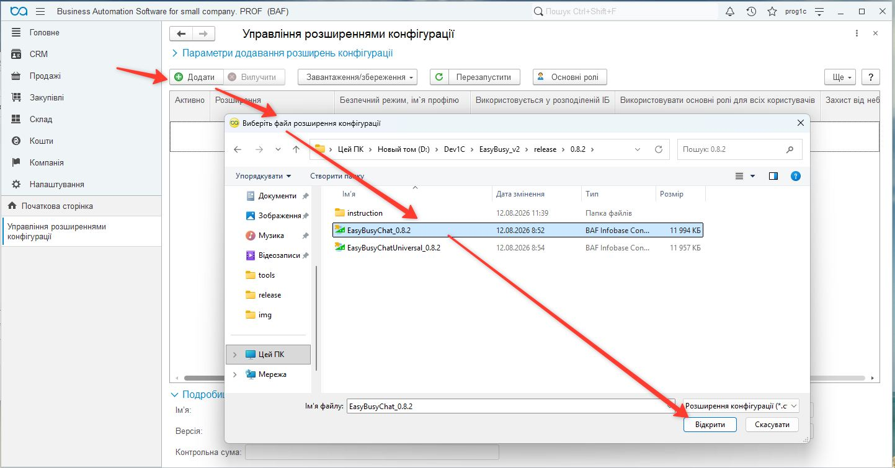

<em>Рисунок 5 — Додавання CFE-файлу до інформаційної бази</em>

### Крок 5. Підтвердьте відкриття файлу

Якщо з’явиться попередження безпеки, перевірте джерело файлу та натисніть **«Так»**, щоб дозволити його відкриття.

  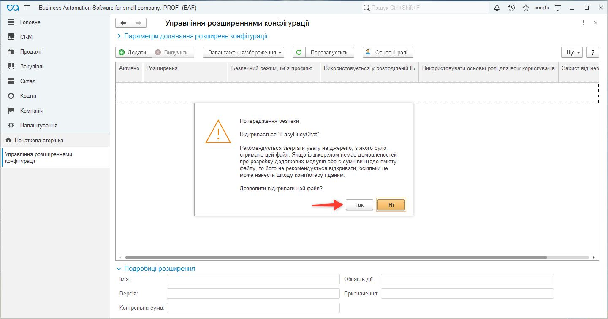

<em>Рисунок 6 — Підтвердження відкриття файлу розширення</em>

> Дозволяйте відкриття лише файлу, отриманого з довіреного джерела. Якщо постачальник публікує контрольну суму або цифровий підпис, перевірте їх перед встановленням.

### Крок 6. За потреби повторіть додавання

У деяких версіях платформи після першого підтвердження безпеки потрібно ще раз натиснути **«Додати»** та повторно вибрати CFE-файл. Після успішного завантаження розширення з’явиться в списку.

  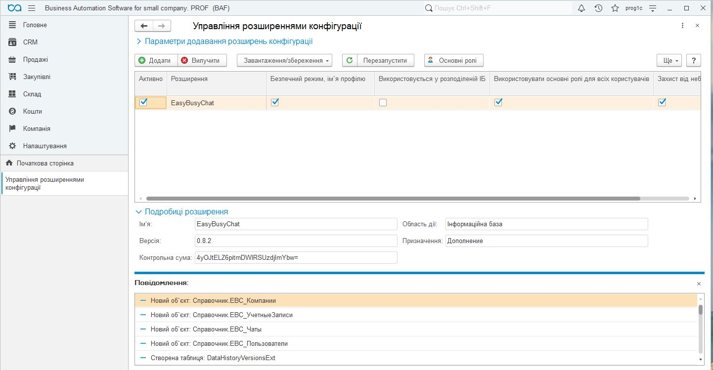

<em>Рисунок 7 — Розширення EasyBusyChat у списку встановлених розширень</em>

### Крок 7. Налаштуйте безпеку та перезапустіть клієнт

Для роботи Native API-компоненти вебчату зніміть для розширення прапорці:

- **«Безпечний режим»**;
- **«Захист від небезпечних дій»**.

Після цього натисніть **«Перезапустити»** та підтвердьте перезапуск клієнта.

  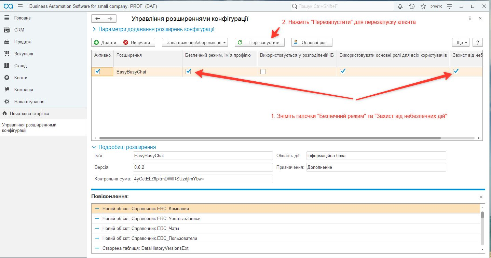

<em>Рисунок 8 — Параметри безпеки, потрібні для роботи вебкомпоненти</em>

> **Застереження щодо безпеки.** Зняття цих прапорців дозволяє розширенню запускати зовнішню компоненту. Виконуйте цю дію лише для перевіреного CFE-файлу. Не встановлюйте для всіх користувачів основні ролі автоматично без оцінки прав доступу; призначайте ролі Easy Busy Chat відповідно до обов’язків користувачів.

---

## Початкове налаштування

### Крок 8. Відкрийте налаштування Easy Busy Chat

Після перезапуску в меню з’явиться підсистема **«Easy-Busy Chat»**. Перейдіть до **Easy-Busy Chat → Адміністрування → Налаштування (EBC)**.

  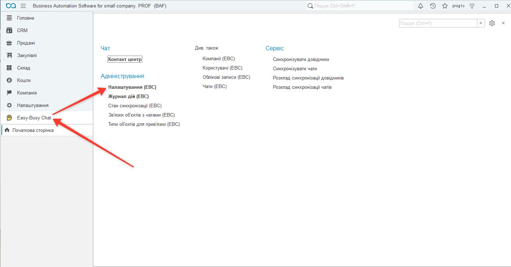

<em>Рисунок 9 — Перехід до початкових налаштувань інтеграції</em>

### Крок 9. Створіть налаштування та підключіть API

1. Натисніть **«Створити»**.
2. Увімкніть інтеграцію.
3. Укажіть базову адресу API, якщо вона не заповнена автоматично.
4. Вставте токен доступу Easy Busy Chat.
5. Натисніть **«Заповнити»**.

Розширення перевірить з’єднання та завантажить доступні компанії, облікові записи й користувачів. За потреби виберіть користувача інформаційної бази, користувача EBC та компанію за замовчуванням.

  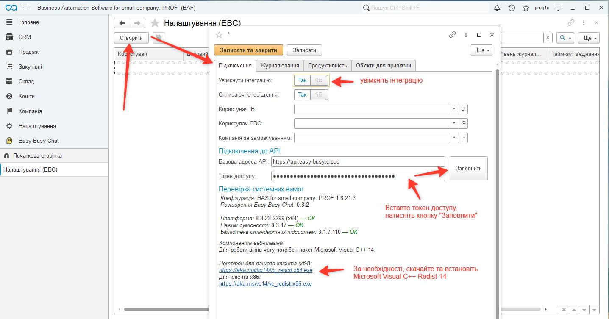

<em>Рисунок 10 — Підключення до API й первинне завантаження довідників</em>

Якщо компоненті бракує бібліотек Microsoft Visual C++ Redistributable 14, установіть пакет відповідної розрядності:

- [Microsoft Visual C++ Redistributable x64](https://aka.ms/vc14/vc_redist.x64.exe);
- [Microsoft Visual C++ Redistributable x86](https://aka.ms/vc14/vc_redist.x86.exe).

> Не публікуйте токен доступу в листуванні, документах або скриншотах. Зберігайте його як секрет і замініть, якщо він міг потрапити до сторонніх осіб.

### Крок 10. Налаштуйте журналювання

На вкладці **«Журналювання»** визначте:

- чи журналювати технічні події;
- чи журналювати дії користувачів;
- мінімальний рівень журналювання;
- кількість днів зберігання журналу.

Для продуктивної бази рекомендовано погодити строк зберігання журналу з адміністратором і вимогами вашої організації.

  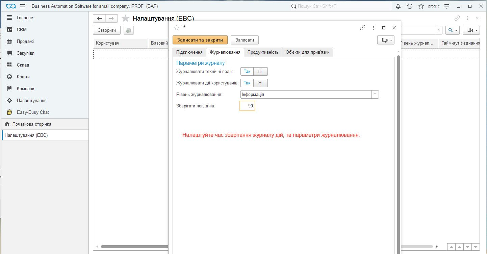

<em>Рисунок 11 — Параметри журналювання та строк зберігання записів</em>

### Крок 11. Виберіть об’єкти для прив’язування чатів

На вкладці **«Об’єкти для прив’язки»** додайте довідники й документи, з якими потрібно пов’язувати чати або з яких потрібно надсилати повідомлення та друковані форми.

Список можна сформувати двома способами:

- додати потрібні типи вручну кнопкою **«Додати»**;
- натиснути **«Додати рекомендовані типи»**, щоб заповнити типовий набір одним кліком.

Перевірте прапорець **«Використовувати»** для кожного потрібного типу та натисніть **«Записати та закрити»**.

  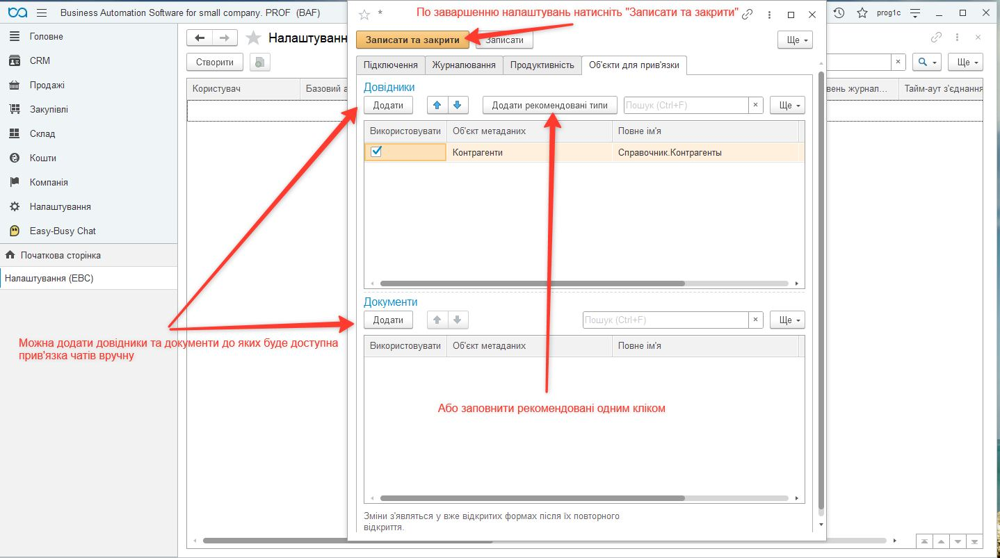

<em>Рисунок 12 — Налаштування об’єктів, доступних для зв’язування з чатами</em>

> Команди Easy Busy Chat з’являться у формах, які вже були відкриті, лише після їх повторного відкриття.

---

## Завантаження чатів

### Крок 12. Синхронізуйте список чатів

Перейдіть до **Easy-Busy Chat → Див. також → Чати (EBC)**.

  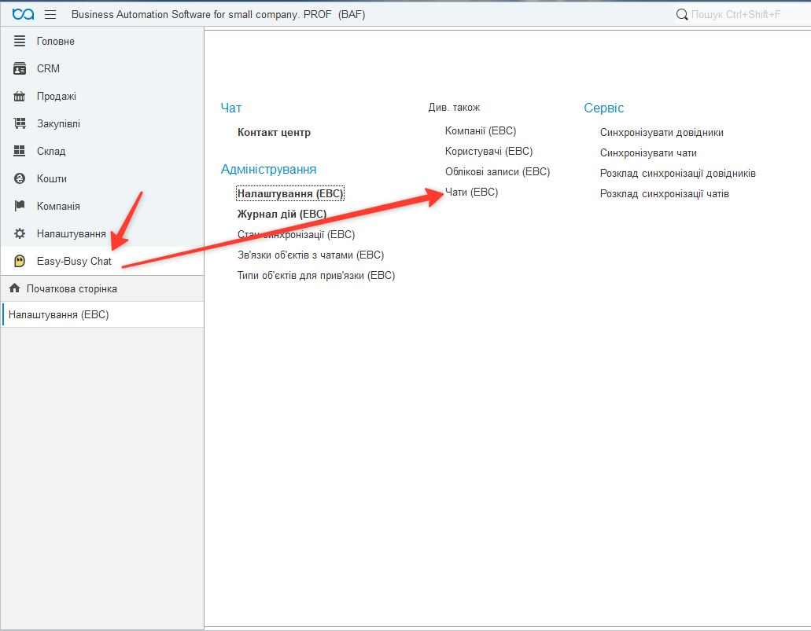

<em>Рисунок 13 — Відкриття списку чатів Easy Busy Chat</em>

У формі списку натисніть **«Завантажити список»** і дочекайтеся завершення синхронізації.

  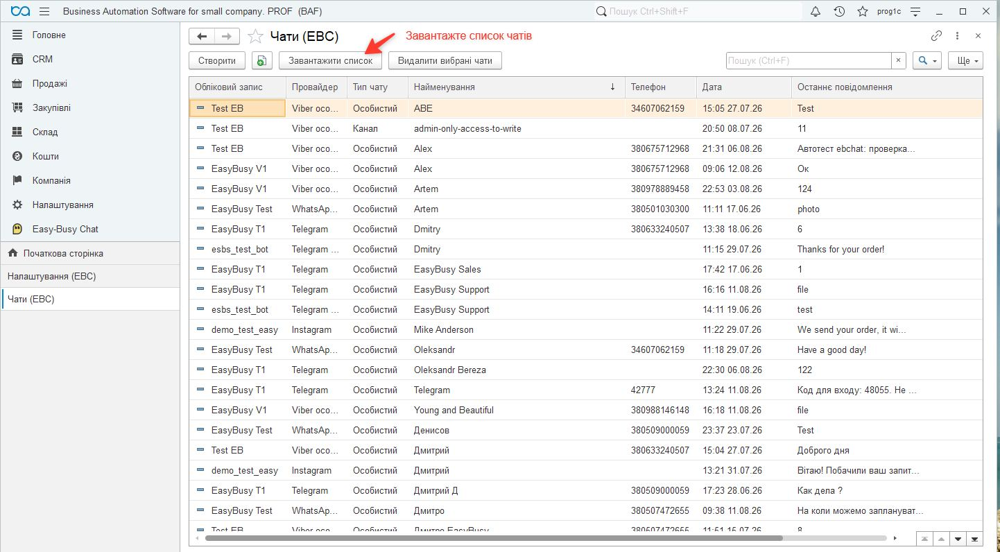

<em>Рисунок 14 — Завантаження актуального списку чатів</em>

---

## Робота з чатами в довідниках і документах

### Крок 13. Використовуйте команди Easy Busy Chat

У формах підключених довідників і документів з’явиться підменю **Easy-Busy Chat**. Залежно від контексту воно містить команди:

- **«Відкрити чат»**;
- **«Прив’язані чати»** — перегляд, створення або зміна зв’язку;
- **«Надіслати повідомлення»**.

  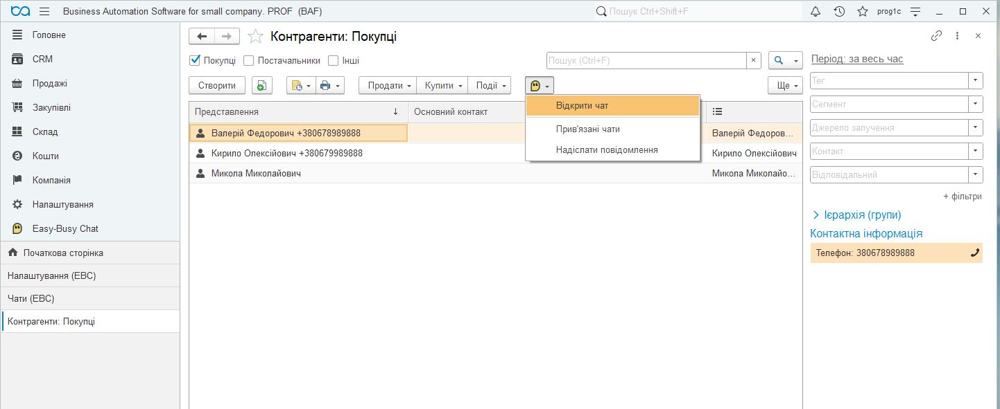

<em>Рисунок 15 — Команди Easy Busy Chat у списку контрагентів</em>

  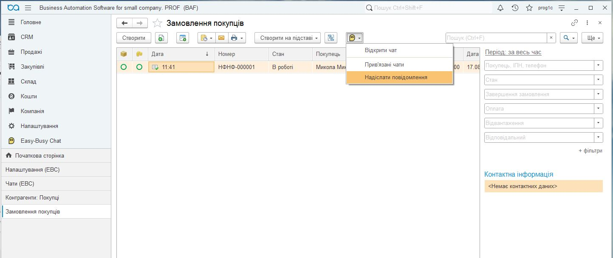

<em>Рисунок 16 — Команди Easy Busy Chat у списку документів</em>

У формі попереднього перегляду друкованої форми доступні команди:

- **«Надіслати як PDF»**;
- **«Надіслати як картинку»**.

Перед надсиланням переконайтеся, що документ пов’язаний із потрібним чатом і друкована форма не містить даних, які не можна передавати одержувачу.

  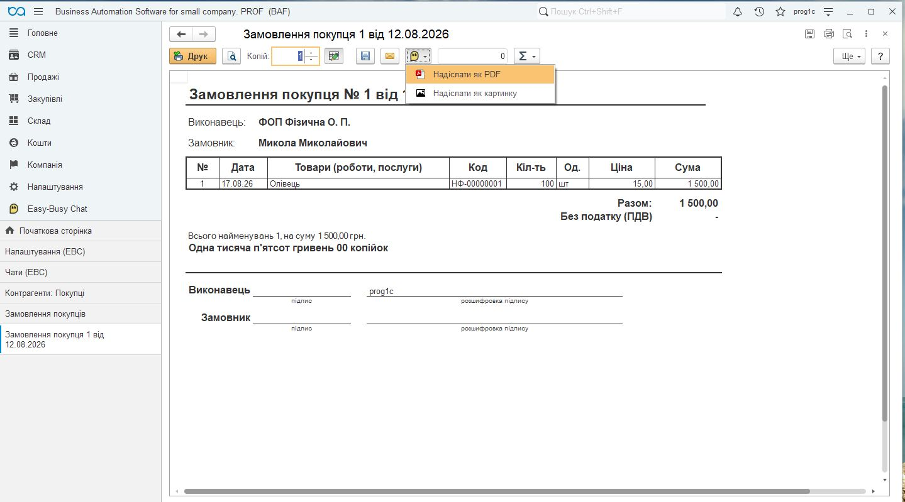

<em>Рисунок 17 — Надсилання друкованої форми як PDF або зображення</em>

---

## Перевірка після встановлення

Після завершення налаштування перевірте:

- [ ] розширення активне й клієнт 1С/BAF перезапущено;
- [ ] підсистема **«Easy-Busy Chat»** відображається в меню;
- [ ] інтеграцію ввімкнено, токен прийнято без помилок;
- [ ] компанії, облікові записи та користувачі EBC завантажилися;
- [ ] список чатів синхронізується;
- [ ] команди Easy Busy Chat з’явилися у вибраних довідниках і документах;
- [ ] у Windows-клієнті відкривається вікно вебчату;
- [ ] тестове текстове повідомлення надсилається в правильний чат;
- [ ] тестова друкована форма надсилається як PDF або зображення;
- [ ] користувачам призначено лише необхідні ролі;
- [ ] у журналі дій немає повторюваних помилок підключення або синхронізації.

---

## Типові проблеми

| Проблема | Що перевірити |
|---|---|
| Підсистема не з’явилася після встановлення | Чи активне розширення; чи виконано перезапуск; чи має користувач потрібні ролі |
| Не відкривається вебвікно чату | Клієнт має працювати під Windows. Установіть Microsoft Visual C++ Redistributable 14 відповідної розрядності: [x86](https://aka.ms/vc14/vc_redist.x86.exe) або [x64](https://aka.ms/vc14/vc_redist.x64.exe). Перевірте антивірус і політики запуску зовнішніх компонент. Вебплагін використовує Microsoft Edge WebView2, який зазвичай уже встановлений у Windows 10/11. Для старіших систем або за відсутності WebView2 [завантажте його з сайту Microsoft](https://developer.microsoft.com/uk-ua/microsoft-edge/webview2), установіть і перезапустіть клієнт 1С/BAF |
| Не вдалося підключити Native API-компоненту | Переконайтеся, що для довіреного розширення вимкнено безпечний режим і захист від небезпечних дій; перевірте журнал реєстрації |
| Не заповнюються компанії або користувачі | Перевірте базову адресу API, чинність токена, HTTPS-доступ і права токена |
| Немає команд у формі довідника або документа | Додайте тип на вкладці «Об’єкти для прив’язки», увімкніть його, збережіть налаштування та повторно відкрийте форму |
| Не завантажуються чати | Перевірте обліковий запис EBC, токен, доступ до API та журнал синхронізації |
| Повідомлення або файл потрапляє не в той чат | Перед надсиланням перевірте зв’язки об’єкта й основний прив’язаний чат |

Якщо проблема повторюється, збережіть текст помилки, дату й час події, версію платформи, конфігурації та розширення. Не додавайте до діагностичних матеріалів токени доступу або конфіденційні дані клієнтів.
